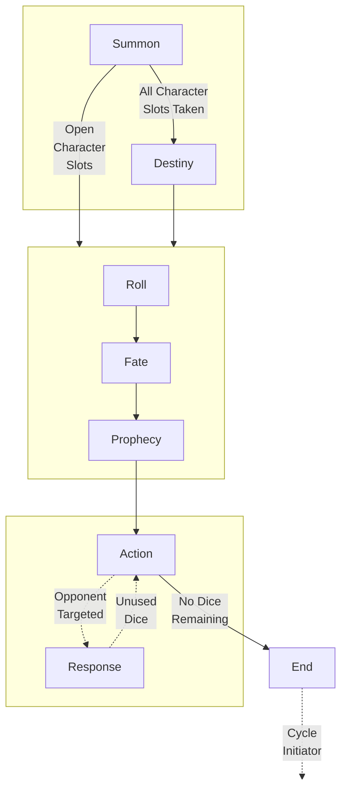

```mermaid
flowchart TB
1a[Summon]
1b[Destiny]
2[Roll]
3[Fate]
4[Prophecy]
5a[Action]
5b[Response]
6[End]

subgraph Start[ ]
	direction LR
	1a -->|All Character<br>Slots Taken| 1b
end

1a --> |Open<br>Character<br>Slots| Middle
1b -->Middle

subgraph Middle[ ]
	2  --> 3
	3  --> 4
end

4  --> 5a
5a -->|No Dice<br> Remaining| 6

subgraph ActionResponse[ ]
	5a -.->|Opponent<br>Targeted| 5b 
	5b -.->|Unused<br>Dice| 5a
end

6 -.->|Cycle<br>Initiator| A[ ]:::empty 

classDef empty width:10px,height:0px;
```
